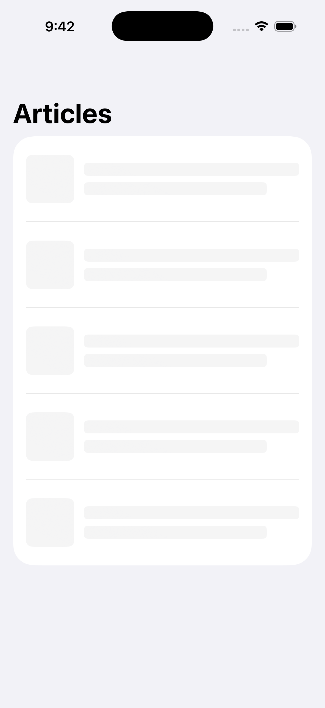
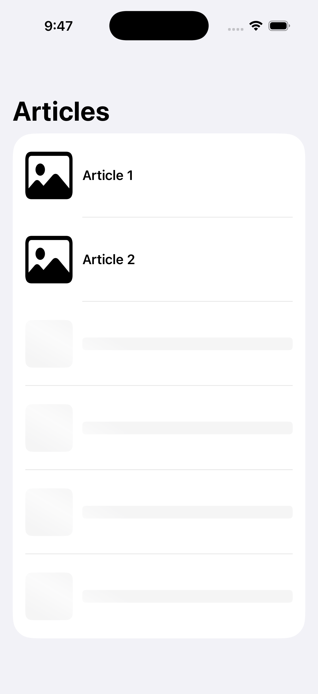
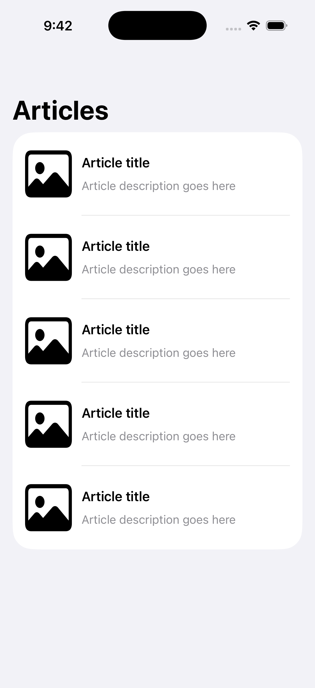

# SwiftUI Skeleton Loading – Progressive Demo

A small demo application that shows how to build a smooth **progressive skeleton loading** experience using **SwiftUI**.

Instead of replacing the entire screen at once, rows are revealed gradually – similar to what real production apps do when data arrives from the network.

## ✨ Features
- Shimmer animation
- Progressive per-row loading
- Clean and simple SwiftUI structure
- Easy to reuse in real projects
- Interview-friendly example

## 🧠 What this project demonstrates
- Handling loading states in SwiftUI
- Building reusable placeholder views
- Improving perceived performance & UX
- Writing UI that feels alive while waiting for data

## 🚀 Tech
- Swift
- SwiftUI

## ▶️ How to run
Open the project in Xcode and run on any simulator.

---
## Preview

Made with ❤️ to practice modern iOS UI patterns.
